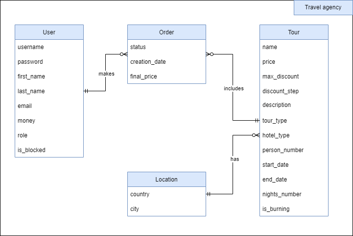

# Travel agency

## TZ
Турагенство має каталог Турів. Для каталогу реалізувати можливість вибірки турів:
- за типом (відпочинок, екскурсія, шопінг);
- за ціною;
- за кількістю осіб;
- за типом готелю.

Користувач реєструється в системі, обирає Тур і робить Замовлення. Після замовлення тур має статус 'зареєстрований'.
Незареєстрований користувач не має можливості замовляти тур.
Користувач має особистий кабінет, в якому міститься коротка інформація про нього, а також список обраних турів і їх поточний статус (зареєстрований, сплачений, скасований).
Менеджер визначає тур як 'палаючий'. 'Палаючі' тури завжди відображаються нагорі переліку. Менеджер переводить статус туру з 'зареєстрований' у 'оплачений' або 'скасований'. На кожен замовлений тур визначається знижка з кроком, який встановлюється менеджером, але не більше відсотка, який так само визначає менеджер.
Адміністратор системи володіє такими ж правами, як і менеджер, а додатково може:
- додати/видалити тур, змінити інформацію про тур;
- заблокувати/розблокувати користувача.

## Use Case diagram


## ER diagram


## DB diagram


## Running
In order to run this app I propose you to use Docker.
1. Clone this repo:
   ```
   git clone https://github.com/OlegChuy/Travel-agency.git
   ```
2. Run docker-compose file.
   ```
   $path\Travel-agency: docker-compose up -d
   ```
